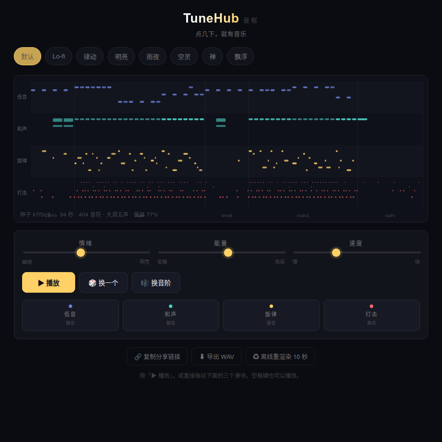

# TuneHub · 音枢 | Ambient Electronic Music Studio

[](LICENSE)
[](#跑起来)
[](#验证)

> **Make ambient electronic music in a few clicks.**
> An open-source, browser-first music generation studio.
>
> **中文补充：** 点几下，生成氛围电子音乐。TuneHub 是开源、浏览器优先的音乐生成实验室。



---

## Features | 功能（中文说明见下文）

打开就有一个 90 多秒的作品。**零音乐知识的人也能立刻用**：

| 操作 | 效果 |
|---|---|
| 点 **▶ 播放** | 直接听 |
| 拖 **情绪 / 能量 / 速度** 三个滑块 | 立刻重新生成——"幽暗↔明亮""安静↔热闹" |
| 点 **🎲 换一个** | 换一个作品；**锁定的声部保持不变** |
| 点声部卡片上的 **静音 / 🔒 锁定** | 锁住喜欢的部分，只重掷其余的 |
| 点 **🎼 换音阶** | 同一个种子换音阶，听出差别 |
| 点 **🔗 复制分享链接** | 链接里就是作品的全部——**不需要服务器** |
| 点 **⬇ 导出 WAV** | 离线渲染整首并下载 |
| 点 **♻ 离线重渲染 10 秒** | 不走实时播放器，直接从种子渲染并试听 |

## 跑起来

```bash
python3 serve.py          # 然后打开 http://127.0.0.1:8765/
```

> 需要本地服务器：页面用的是 ES Module，直接双击 `index.html` 会被 `file://` 的 CORS 拦下。

**零依赖、零构建、零 npm install。** 全部是原生 Web Audio + 原生 ES Module。

## 验证

```bash
node --test "tests/*.test.mjs"                    # 41 项内核与音频测试
node tests/run-browser-check.mjs http://127.0.0.1:8765   # 12 项浏览器真机自检
```

浏览器自检覆盖纯 Node 测不到的路径：`OfflineAudioContext` 区间渲染、WAV 编码与**回解码**、实时播放器真的出声（Analyser 读到非零信号）、区间切分。

也可以直接在浏览器里打开 <http://127.0.0.1:8765/tests/browser.html> 看结果。

## 名字

**TuneHub · 音枢** —— tune（曲调）+ hub（枢纽）。
"音枢"取"音之枢机"：既是创作的中心，也是各种音阶、风格、玩法汇聚与交换的地方。

（曾用名 Sonosphere、Riffle，均已弃用。）

---

## 它是怎么做到"随便掷都好听"的

这是整个项目最核心的工程问题。随机参数直出必然难听——demo 那种"每个参数独立随机"会产生音区打架、小二度碰撞、密度失控。

TuneHub 的做法是**从一开始就不进入难听区域**，四个手段：

| 手段 | 实现 |
|---|---|
| **音程悦耳度加权** | 纯五/纯四/三六度权重高；小二度、三全音、大七度权重≈0.02–0.05。旋律是**加权游走**，不是均匀随机 |
| **声部音区严格隔离** | 低音 36–50 < 和声 52–64 < 旋律 66–81，硬性护栏，极端参数下也不越界 |
| **每声部独立随机子流** | 改一个声部不会污染其它声部（"锁 + 重掷"因此才成立） |
| **宏观结构 + 密度包络** | 五段式（intro/main/break/main2/outro）、声部逐层进退场、调性中心随段落以五度圈缓慢移动 |

另外还有**混音链**：总线压缩 + 限制器 + 每声部滤波 + 程序生成的卷积混响（IR 由种子合成，无需下载资源、无版权问题）。

界面上实时显示的"**悦耳度 77%**"就是这套模型的客观输出（不协和碰撞率、密度尖峰、同度碰撞的加权）。

**测试保证**：100 个随机种子跑下来 `verdict` 无一为 `poor`，平均悦耳度 > 0.8。

## 架构：为"能被别人扩展"而设计

```
src/core/     纯内核：无 DOM、无 Audio、可在 Node 里测。确定性生成
src/audio/    适配器：原生 Web Audio。含实时播放器与离线渲染
src/ui/       界面：只负责画出来 + 把点击翻译成配置
```

三条硬约束（都来自终点 demo 的教训）：

1. **内核中禁止裸 `Math.random()`** —— 否则"保存种子"根本无法实现
2. **禁止 `setTimeout` 参与发声调度** —— 否则离线渲染彻底失效
3. **噪声也必须确定性** —— 混响 IR 与打击底噪由种子派生。这点最初写错了，被浏览器自检抓到：两次渲染最大样本差 0.507；修复后降到 ~6e-7（float32 机器精度）

**作品 = (种子, 配置, 声部种子覆盖)**，序列化后就 30 来个字符，所以分享链接不需要任何后端。

## 已经预留但尚未接上的扩展点

设计文档规划了内容注册机制，但扩展接口的数量与拆分方式尚未冻结。社区可以用类型化常量贡献静态素材，也可以用一个代码模块整体表达相互耦合的音乐行为：

```
律制 │ 音阶 │ 框架/节奏/奏法 │ 可选风格预设
声部 │ 乐器能力 │ 音色/主题素材 │ 可视化 visualizer │ 算子 operator
```

`framework`、`rhythm`、装饰与奏法可以由同一个代码生成器共同处理；只有确有复用需要时才拆成独立素材。声部是编曲角色，乐器描述可演奏能力并关联发声实现，音色是具体的声音配方。MVP 里的 `SCALES`、`PATCHES` 与 `RHYTHM_PATTERNS` 仍是现有实现，不代表未来必须沿用同样的扩展分类；当前 `PATCHES` 还是音色配方，尚非完整乐器定义。JSON 保留为导入 / 导出兼容格式。

`examples/` 里还有可运行的**内容包校验器**与 **AI 层回归测试集**（见下）。

## 目录

```
├── index.html            单页应用
├── serve.py              本地静态服务器
├── src/
│   ├── core/             rng.mjs · model.mjs · generate.mjs
│   ├── audio/            engine.mjs · player.mjs · export.mjs
│   └── ui/               app.mjs · style.css
├── tests/
│   ├── kernel.test.mjs   内核测试（确定性 / 听感 / 音区）
│   ├── audio.test.mjs    音频冒烟测试（Web Audio 桩件）
│   ├── browser.html      浏览器自检页
│   └── run-browser-check.mjs  CDP 无头验证运行器
├── docs/
│   ├── OVERVIEW.md       原则、AI 融合、竞品、"内容"定义
│   ├── ARCHITECTURE.md   数据模型、扩展点、Action 协议、选型
│   ├── ROADMAP.md        M0–M7 任务与验收标准
│   └── archive/          早期调研全文（12 份）
└── prototype/
    └── original-demo.html  起点 demo（归档，只读）
```

## MVP 还没做的

诚实交代（对应 `docs/ROADMAP.md`）：

- **M1 好听**：骨架已具备（悦耳度加权、音区隔离、混音链），但只有 4 种音色、没有人工盲测过的预设库
- **M3 第一个游戏**：未做
- **M2.5 AI / MCP Server**：未做。协议已在 `docs/ARCHITECTURE.md` §4 定义，但代码未写
- **M4 内容生态**：早期 JSON 样板与校验器已在 `examples/`，未接入本 MVP；目标作者格式调整为类型化 TypeScript 内容包，JSON 保留为兼容导入 / 导出格式
- **M6 律制层**：`Pitch` 抽象已留好（支持小数音符号），但只实现了 12-TET；`.scl` 解析、音分偏差可视化未做
- **区间导出 UI**：导出引擎已支持任意 `[t1,t2]`，界面还只暴露"导出整首"

## 已定但未实施的决策

- **AI 融合只做 MCP Server / Skill，不内置对话界面**（用户决定）
- 主许可建议 **Apache-2.0**；内容与代码分仓（待拍板）
- 第一个游戏形态建议**节奏点击**（待拍板）

## 许可

**Apache License 2.0** —— 见 [LICENSE](LICENSE) 与 [NOTICE](NOTICE)。

选择 Apache-2.0 而非 MIT 的原因：它含**明确的专利授权条款**，对一个涉及
DSP 与生成算法的项目更稳妥，同时仍与所有推荐依赖兼容。

**运行时零第三方依赖**，因此不存在许可证传染问题。CI 中仍建议保留一道
卡口：扫描依赖树，出现 `GPL`/`AGPL` 即构建失败（详见 `docs/ARCHITECTURE.md` §5）。

`prototype/original-demo.html` 是项目的起点归档，非本项目原创代码，仅供历史参考。
