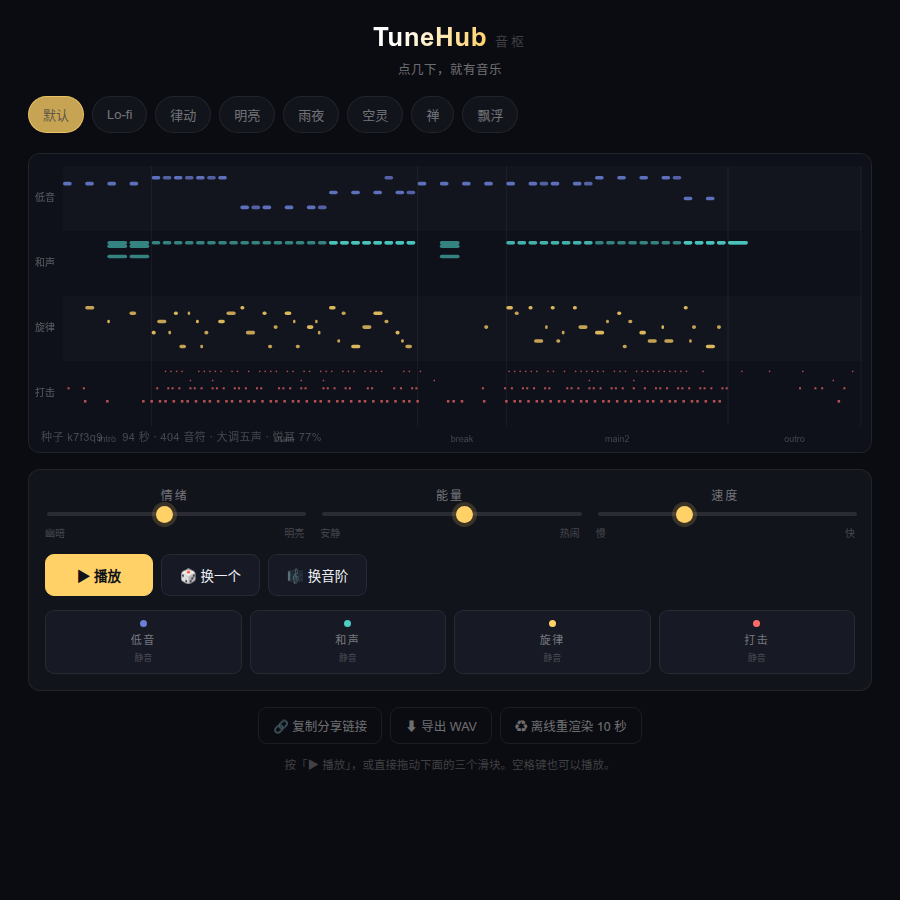

# TuneHub: Ambient Music Studio

[简体中文](docs/zh-CN/README.md)

TuneHub is an open-source, browser-based studio for creating ambient music. Explore musical ideas by listening and playing—no music theory required.



## Open TuneHub

From the project directory, run:

```bash
python3 serve.py
```

Then open <http://127.0.0.1:8765/> in your browser. TuneHub needs a local server to load its JavaScript modules; there is no build or install step.

## Install it as an app (PWA)

TuneHub is a progressive web app: it can be installed, it works offline, and it keeps playing with the screen off.

- **Android / desktop Chrome or Edge**: open the site and use the **⬇ Install app** button, or the install icon in the address bar.
- **iOS Safari**: Share → **Add to Home Screen**.

An installed TuneHub launches without browser chrome and precaches the whole studio (pages, modules, styles, icons) through a service worker, so it still opens and plays with no network.

### Playback with the screen off

Phones only grant background playback to a **real media element**. A Web Audio graph wired straight to the speakers gets no audio focus, and Android Chrome throttles and then freezes the page about a minute after the screen goes dark — the music stops. So TuneHub does not play Web Audio directly. It renders the piece ahead of the playhead and hands real audio to an `<audio>` element:

```
event stream → OfflineAudioContext (far faster than real time)
             → WebCodecs AudioEncoder (Opus)
             → WebM muxer (written from scratch, no dependencies)
             → MediaSource → <audio>
```

- The **Media Session API** publishes the current piece to the lock screen, notification shade, headset buttons and keyboard media keys. Play, pause, stop and seek all route back into the player.
- The pipeline keeps roughly 45 seconds buffered ahead of the playhead; slices are rendered with a six-second overlap that is trimmed away, so the reverb tails survive the joins and the seams are inaudible.
- If a device has no WebCodecs, no `MediaSource` or no Opus encoder (Safari today), the same player object silently falls back to live Web Audio synthesis. Everything still works; only the screen-off promise degrades.
- The cost of this design: changing a slider re-synthesizes the piece, so a tweak takes about a second to be heard instead of being instant.

Platform reality check: on Android the music now keeps playing with the screen off, because the operating system sees an ordinary media stream. On iOS the fallback path still depends on how long Safari lets an AudioContext live after a lock. That is a platform limit, not a TuneHub setting.

## Deploy your own copy

TuneHub is a static site: any static host works. The maintainers run it at <https://music.cyberbee.top> on Tencent COS behind Tencent CDN; see [`deploy/README.md`](deploy/README.md) for the scripts.

Secrets are never committed. Deployment credentials live in `deploy/.env.deploy.local`, which `.gitignore` excludes — start from [`deploy/.env.deploy.example`](deploy/.env.deploy.example).

<details>
<summary>Why I made TuneHub</summary>

This project began on a whim. I’m a software engineer, and I’ve loved instrumental music since I was a child—from Bandari and Secret Garden to Ryuichi Sakamoto and Roc Chen (A Kun), from FKJ to Hans Zimmer, from Audiomachine to David Garrett. This music has helped me think and kept me company as I fell asleep. But I know very little about music. I tried to learn, without much success. Large music-generation models have given more people the chance to create songs, but they haven’t quite met what I’m looking for: I don’t only want to hear the music I have in mind; I also want to enjoy making it—playing with music.

I was building a tower-defense game where every tower attack would generate a note. When dozens of towers attacked at once, the sound became a jumble. I asked AI whether an algorithm could turn those scattered notes into music. After some work, it gave me music-theory terms I couldn’t understand and a demo. I opened the HTML file and found that random notes really could become music. I couldn’t wait to share it with my friends, and they liked it too. I felt I might have found a way for people with little musical knowledge to take part in making music, and the outline of a project began to form in my mind. Generative music has been around for a long time, but with AI’s help, this approach might become practical—not only for software engineers who don’t know music theory, but also for musicians who do.

I’ve listened to instrumental music for 15 years and explored many kinds. I know today’s random music generators still have a long way to go before they can reach their full potential.

Finally, I want to mention the film *Les Choristes* (*The Chorus*). It showed me how music can bring people together, bridge divides, and heal. Our world has too much conflict, mistrust, and exploitation. I hope this project can encourage people to create and share.

</details>
